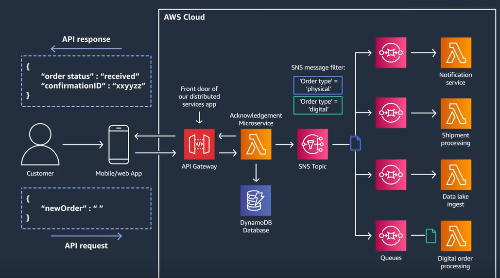

# Building Fan-Out Serverless Architecture

Microservices based architectures require scalable and durable messaging systems to act as the backbone of the application. By using SNS and SQS to build fan-out patterns, you can simplify microservices communication and scale them seamlessly



## Installation

- Download and install [Node Js](https://nodejs.org/en/)
- Download and run the [AWS CLI](https://docs.aws.amazon.com/cli/latest/userguide/getting-started-install.html) MSI installer

Install the serverless CLI via NPM:

```bash
npm install -g serverless
```

Once AWS CLI is installed, configure AWS CLI with AWS Access Key ID and AWS Secret Access Key.

```bash
 aws configure
```

Install node modules via NPM

```bash
npm i
```

## After Successful Installation uses the below to deploy serverless code to AWS.

```bash
serverless deploy --stage dev
```
